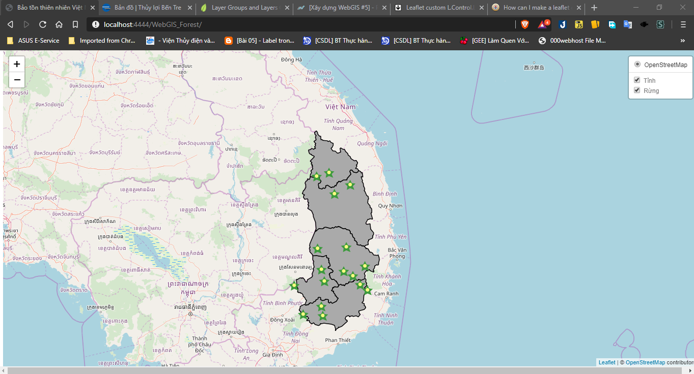
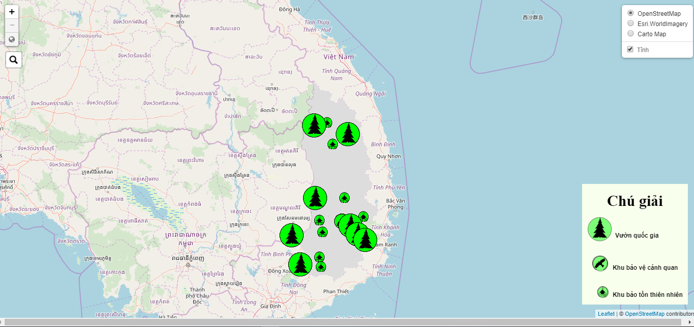
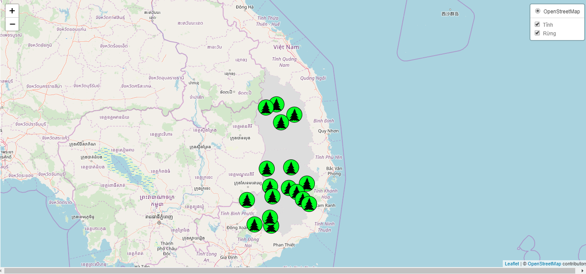
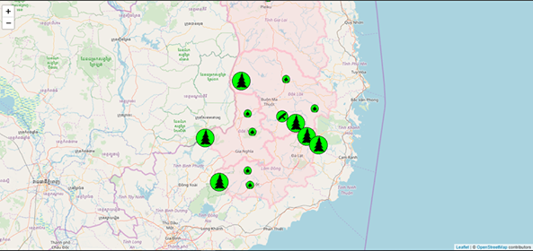
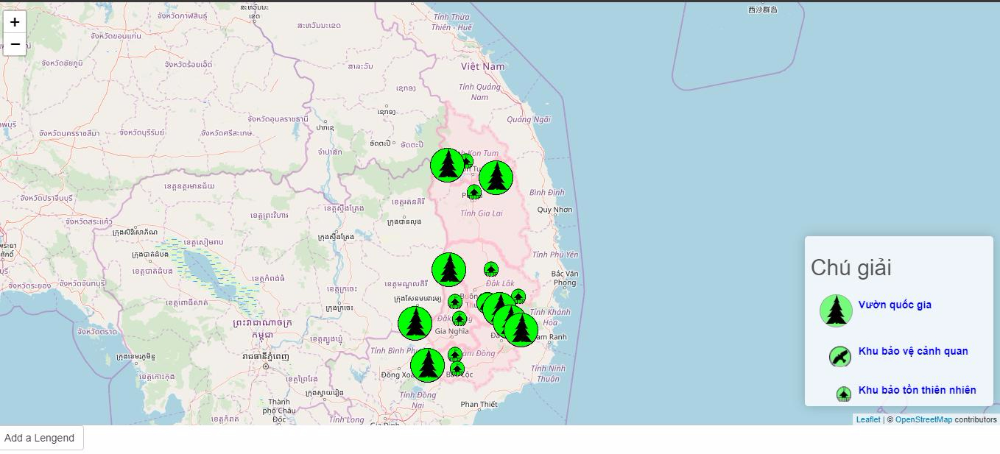
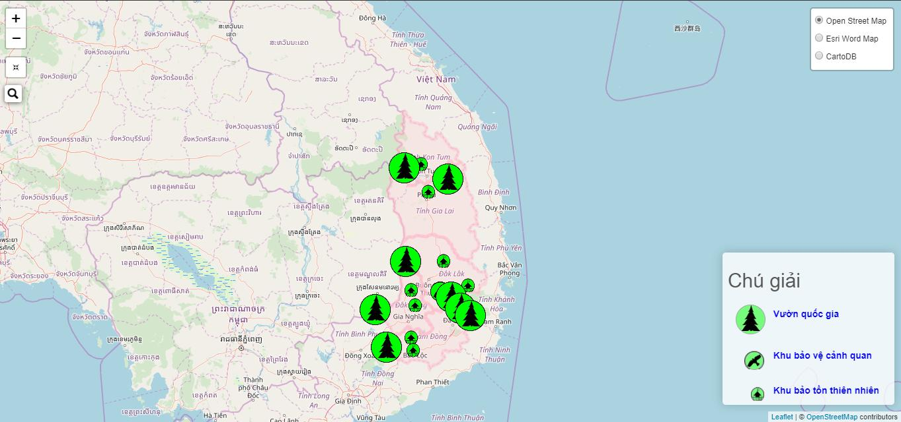

# WebGIS of Forest

## Note 1
+ Note 1.0: Đã upload dữ liệu lên Geoserver và view lên Web để nhìn tổng quan

+ Note 1.1: Quay lại ý tưởng Leaflet và Geoserver
    - Hoàn thành tương đương như R Shiny Leaflet
    - Sử dụng nhiều thư viện khác nhau hỗ trợ cho leaflet như: leaflet-searrch, leaflet-providers.js, leaflet-ajax, L.Control.ZoomMin
    - Chuyển đổi dữ liệu shp sang 2 dạng chính là json và js (biến chuỗi json thành biến trong javascript)
    - Áp dụng kỹ thuật $.getJSON để biên tập dữ liệu định lượng

## Note 2
+ Note 2: Geoserver không hỗ trợ xuất điểm có thứ tự

## Note 3
+ Note 3: Chuyển sang R Shiny Leaflet

## Note 4
+ Note 4:
    + Làm việc trên R Shiny Leaflet 
    + Custom Icon Legend - khả năng tự động hóa thấp
    + Tương đối hạn chê khi viết javascript, có hình ảnh phải chèn chuỗi String dạng Base 64

## Note 5
+ Note 5:
    + Làm việc trên R Shiny Leaflet - thêm package leaflet extract
    + Custom Icon Legend - cao hơn Note 4
    + Thêm Layer Base Map Control
    + Loại bỏ button, thêm search bar và reset layout map
    + Không cần thông qua javascript
    + Hình ảnh vẫn chưa khắc phục (phải chuyển quan base 64)
