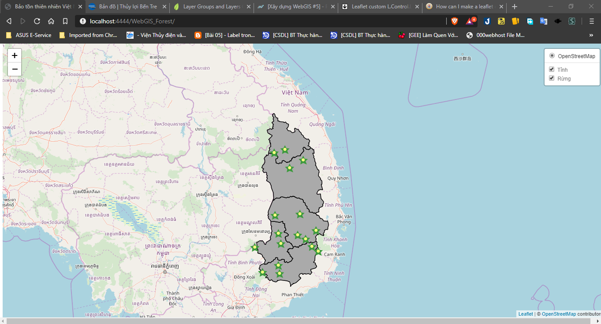
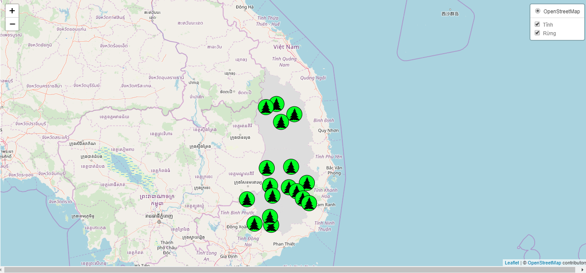
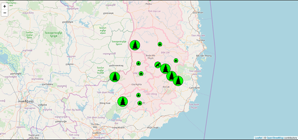
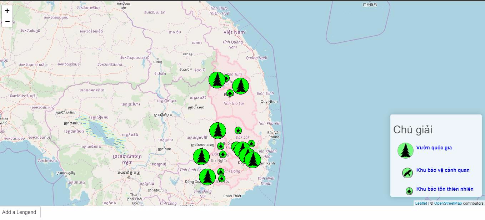

# WebGIS of Forest
+ Note 1: Đã upload dữ liệu lên Geoserver và view lên Web để nhìn tổng quan

+ Note 2: Geoserver không hỗ trợ xuất điểm có thứ tự

+ Note 3: Chuyển sang R Shiny Leaflet

+ Note 4:
    + Làm việc trên R Shiny Leaflet 
    + Custom Icon - khả năng tự động hóa thấp
    + Tương đối hạn chê khi viết javascript, có hình ảnh phải chèn chuỗi String dạng Base 64
