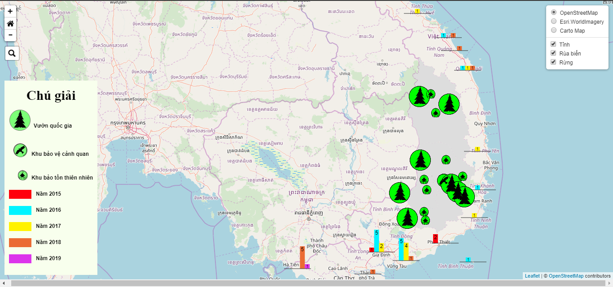

# WebGIS of Forest

## Note 1
+ Note 1.0: Đã upload dữ liệu lên Geoserver và view lên Web để nhìn tổng quan

+ <a href='https://nguyenduclam.github.io/webatlas_taynguyen_forest/index.html'>Link Demo</a>

### Note 1.1: Quay lại ý tưởng Leaflet và Geoserver
+ Hoàn thành tương đương như R Shiny Leaflet
+ Sử dụng nhiều thư viện khác nhau hỗ trợ cho leaflet như: leaflet-searrch, leaflet-providers.js, leaflet-ajax, L.Control.ZoomMin
+ Chuyển đổi dữ liệu shp sang 2 dạng chính là json và js (biến chuỗi json thành biến trong javascript)
+ Áp dụng kỹ thuật $.getJSON để biên tập dữ liệu định lượng
+ Chưa bật tắt được các lớp $.getJSON

### Note 1.2: Thêm Bar Chart và bật tắt các lớp
+ Đã bật tắt được các lớp $.getJSON
+ Thay đổi thư viện L.Control.ZoomMin thành leaflet.zoomhome
+ Không sử dụng dữ liệu js, chỉ còn sử dụng json hoặc geoJSON
+ Thêm Bar Chart bằng thư viện leaflet.mincharts (có hỗ trợ cả bên R)

### Note 1.3: Thêm Popup cho Chart
+ Thêm và style lại Popup - dựa theo mẫu của R

<h3>Vấn đề mới</h3>
<h4>Cách 1</h4>
<h5>Idea</h5>
    + Nên dynamic legend: bật lớp nào thì chỉ cần hiện legend lớp đó
     
    + Nếu bật lớp khác thì tự động tắt lớp vừa bật
<h4>Cách 2</h4>
<h5>Idea</h5>
    + Cho kéo thả legend
     
    + Hoặc tự động fix legend nhỏ lại
<h4>Cách 3</h4>
Gộp cả 2 cách trên: vừa cho phép dynamic, vừa cho phép kéo thả

### Note 1.4: Chỉnh sửa legend - có thể bật tắt
<a href='http://apps.socib.es/Leaflet.TimeDimension/examples/'>Preference</a>
+ Đã có thể Draggable - kéo thả Legend
+ Đã có thể Dynamic - bật tắt lớp hiển thị thì legend cũng bật tắt theo

### Note 1.5: Thêm lớp base JSON - không sử dụng thông qua WMS Geoserver
+ Do chưa cài đặt Geoserver lên các domain khác nên không sử dụng
+ Tính thẩm mỹ: đẹp hơn so với màu xám - cũng như muốn tận dụng các providers khác

## Note 2
+ Note 2: Geoserver không hỗ trợ xuất điểm có thứ tự

## Note 3
+ Note 3: Chuyển sang R Shiny Leaflet

## Note 4
+ Note 4:
    + Làm việc trên R Shiny Leaflet 
    + Custom Icon Legend - khả năng tự động hóa thấp
    + Tương đối hạn chế khi viết javascript, có hình ảnh phải chèn chuỗi String dạng Base 64

## Note 5
+ Note 5:
    + Làm việc trên R Shiny Leaflet - thêm package leaflet extract
    + Custom Icon Legend - cao hơn Note 4
    + Thêm Layer Base Map Control
    + Loại bỏ button, thêm search bar và reset layout map
    + Không cần thông qua javascript
    + Hình ảnh vẫn chưa khắc phục (phải chuyển qua base 64)

## Note 6
+ Note 6:
    + Nhược điểm lớn của R: Load chậm hơn
    + Thêm Chart cho bộ dữ liệu
    + Không thể bật tắt Chart (do LayerGroup không hỗ trợ)
